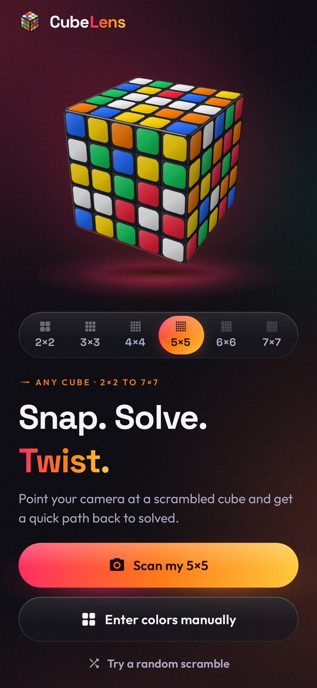
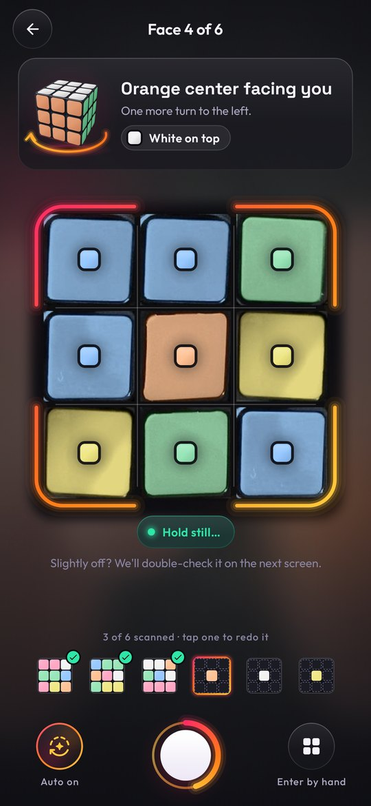
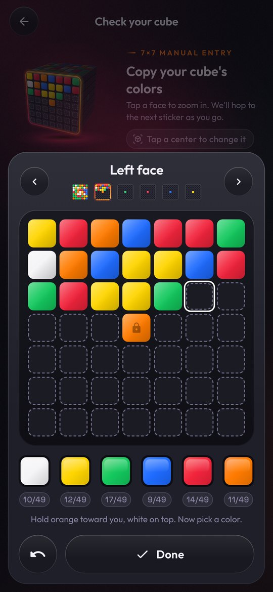
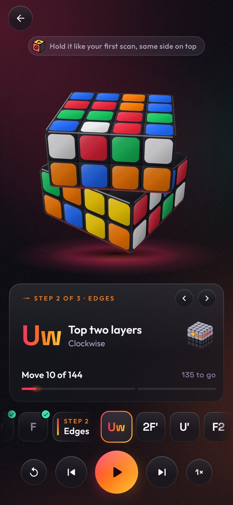
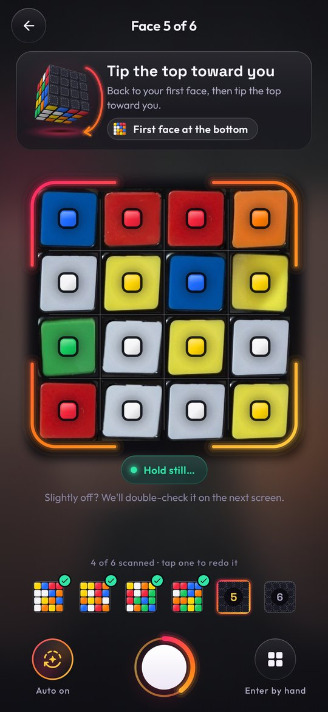
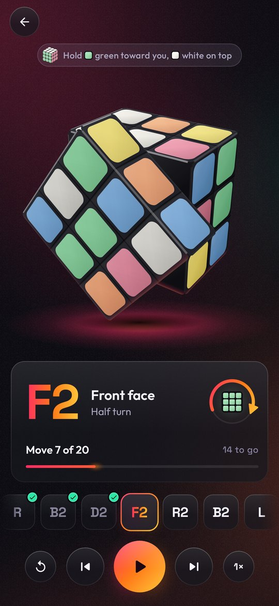

# CubeLens

**Snap. Solve. Twist.** An Android app that reads a scrambled cube through the camera and walks
you back to solved, one animated turn at a time. Works for every size from 2×2 to 7×7, including
knock-off cubes with pastel stickers or unusual color layouts.

<p align="center">
  
  
  
  
</p>

## Features

- **Any size.** 2×2, 3×3, 4×4, 5×5, 6×6 and 7×7. Pick the size on the home screen.
- **Camera scanning.** Line a face up with the on-screen guide and the app reads every sticker
  live. It can capture automatically once the reading is steady. Guided steps show how to hold the
  cube for each face: by center color on odd sizes, and by position on even sizes, which have no
  fixed centers.
- **Robust color reading.** All stickers are classified together, so each color is used exactly
  N² times. Lighting and white balance are compensated per photo. Faces scanned at the wrong
  rotation are straightened automatically. A face scanned twice is detected, and any sticker that
  is a close call gets flagged for a quick check.
- **Knock-off and pastel cubes.** Colors are named by how they relate to each other, not by fixed
  reference values. Live colors adapt to your cube as you scan, and the 3D cube, net and playback
  draw your cube in its own colors. Non-standard color arrangements (e.g. white opposite blue)
  work too.
- **Check and edit.** An unfolded net plus a 3D preview, with a zoomed face editor for big cubes.
  The checks explain in plain words when something can't be right.
- **Solutions.**
  - 2×2: optimal (≤ 11 moves).
  - 3×3: Herbert Kociemba's two-phase algorithm, usually ≤ 20 moves.
  - 4×4 and up: corners first (or a 3×3 frame on odd sizes), then edges and centers with
    computer-searched commutators. Typical lengths: 4×4 ≈ 140, 5×5 ≈ 200, 7×7 ≈ 500 moves.
- **Animated playback.** A glossy, real-time 3D cube turns each layer, including wide (`Rw`,
  `3Rw`) and inner-slice (`2R`) moves. The steps come in stages (Corners → Edges → Centers), each
  explained in plain words ("2nd layer from the right · clockwise"). You can play or pause, step,
  change the speed, or jump to any move or stage.
- Manual color entry and a random-scramble demo for every size. Progress survives the app being
  closed in the background.

<p align="center">
  
  
</p>

## Install

Every push builds the app on GitHub Actions (`.github/workflows/android.yml`). Open the latest
run under **Actions → Android build** and download the **CubeLens-apk** artifact. The release APK
is signed with a debug key, so it is sideloadable but not for the Play Store.

## Build locally

Requirements: JDK 17+ and the Android SDK (platform 37).

```sh
./gradlew :core:test                 # cube models, solvers, color vision (fast JVM tests)
./gradlew :app:testDebugUnitTest     # app logic, end-to-end launch tests, Roborazzi screenshots
./gradlew :app:assembleRelease       # app/build/outputs/apk/release/app-release.apk
```

Screenshot tests write PNGs to `app/build/outputs/roborazzi/`.

## How it works

```
camera frame ─▶ GridSampler (N×N) ─▶ AdaptiveLiveClassifier (live preview, learns your colors)
                      │
          6 scans ────┴─▶ ScanResolver ─▶ joint clustering ─▶ placement + orientation fixing ─▶ validator
                                                                                                  │
                     Cube3D playback ◀── NxNSolver (2×2 table · 3×3 two-phase · N×N commutators) ◀┘
```

| Module | What's inside |
|---|---|
| `:core` (pure Kotlin) | `cube/`: 3×3 facelet model, moves derived from 3D rotations (so the solver and the renderer can never disagree), cubie model, validator. `solver/`: two-phase solver with cached tables. `nxn/`: N×N geometry, wide/slice moves, validator with color-scheme inference, 2×2 and big-cube solvers, scrambler. `vision/`: sRGB→CIELAB, CIEDE2000, grid sampling, live and adaptive classifiers, joint sticker assignment, palette estimation, orientation fixing. |
| `:app` (Compose + CameraX) | `ui/theme` and `ui/components`: the "sunset on ink" design system (see [docs/DESIGN.md](docs/DESIGN.md)). `ui/cube`: Canvas-based 3D cube, net and face editor for any size and palette. `ui/home`, `ui/scan`, `ui/review`, `ui/solve`: the screens. |

Stickers follow the Kociemba layout (`U R F D L B`, N² stickers per face).

## Credits

- Two-phase algorithm by Herbert Kociemba. This is an independent implementation.
- Fonts: [Space Grotesk](https://github.com/floriankarsten/space-grotesk) and
  [Outfit](https://github.com/Outfitio/Outfit-Fonts), both under the SIL Open Font License (see
  `licenses/`).
